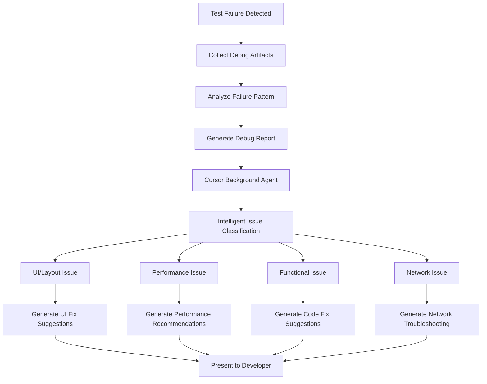

# 🎯 UI Testing Strategy Guide for Cursor Background Agents

## Executive Summary

This guide outlines a comprehensive strategy for implementing automated UI testing that enables Cursor background agents to run tests on current builds, perform essential smoke tests, and provide intelligent debugging support when issues are reported.

## 📊 Current State of UI Testing for React Native (2024/2025)

### 🏆 Leading Frameworks Comparison

| Framework | Best For | Cursor Agent Support | Setup Complexity | Performance |
|-----------|----------|---------------------|------------------|-------------|
| **Detox** | React Native-specific | ✅ Excellent | Medium | Very Fast |
| **Appium** | Cross-platform | ✅ Good | High | Moderate |
| **Maestro** | Simple E2E testing | ✅ Excellent | Low | Fast |
| **Cypress** | Web version testing | ✅ Excellent | Low | Fast |
| **Playwright** | Modern web testing | ✅ Good | Medium | Very Fast |

### 📈 2024/2025 Trends

1. **Cloud-First Testing** - Shift from local device labs to cloud services
2. **AI-Powered Test Generation** - Automated test creation and maintenance
3. **Visual Regression Testing** - Pixel-perfect UI consistency checking
4. **Multi-Platform Convergence** - Single tests running across platforms
5. **CI/CD Integration** - Seamless pipeline integration for background agents

## 🏗️ Service Architecture Options

### Option 1: Hybrid Local + Cloud Architecture (Recommended)


#### **Local Testing Layer**
- **Purpose**: Fast feedback, build verification, basic smoke tests
- **Tools**: Enhanced test script + Cypress web testing
- **Runtime**: 2-5 minutes
- **Cost**: Low (uses existing infrastructure)

#### **Cloud Testing Layer**
- **Purpose**: Comprehensive device testing, visual regression, performance
- **Tools**: BrowserStack/Sauce Labs + Maestro/Detox
- **Runtime**: 10-30 minutes
- **Cost**: Moderate (cloud service fees)

### Option 2: Full Cloud Architecture


#### **Advantages**
- **Scalability**: Unlimited parallel execution
- **Device Coverage**: Access to latest devices
- **Maintenance**: No local infrastructure management
- **Reliability**: Enterprise-grade uptime

#### **Considerations**
- **Cost**: Higher operational costs
- **Latency**: Network dependency
- **Security**: Data transmission concerns

### Option 3: Serverless Testing Architecture


## 🛠️ Implementation Strategy

### Phase 1: Foundation Setup (Week 1-2)

#### **1.1 Enhanced Local Testing**
```bash
# Install core testing frameworks
cd VoiceJournal
npm install --save-dev cypress @playwright/test maestro-cli

# Setup test configuration
mkdir -p cypress/e2e tests/visual tests/smoke
```

#### **1.2 Cloud Service Integration**
```javascript
// cloud-test-config.js
module.exports = {
  browserstack: {
    username: process.env.BROWSERSTACK_USERNAME,
    accessKey: process.env.BROWSERSTACK_ACCESS_KEY,
    capabilities: {
      'browserstack.debug': true,
      'browserstack.networkProfile': 'normal'
    }
  },
  sauceLabs: {
    username: process.env.SAUCE_USERNAME,
    accessKey: process.env.SAUCE_ACCESS_KEY,
    region: 'us-west-1'
  }
}
```

#### **1.3 Test Orchestration Service**
```javascript
// test-orchestrator.js
class TestOrchestrator {
  constructor(config) {
    this.localRunner = new LocalTestRunner()
    this.cloudRunner = new CloudTestRunner(config)
    this.aiAnalyzer = new TestResultsAnalyzer()
  }

  async runSmokeSuite(buildArtifacts) {
    const results = await Promise.all([
      this.localRunner.runSmoke(buildArtifacts),
      this.cloudRunner.runCriticalPath(buildArtifacts)
    ])
    
    return this.aiAnalyzer.analyzeResults(results)
  }
}
```

### Phase 2: Smoke Test Implementation (Week 3-4)

#### **2.1 Essential Smoke Tests**
```javascript
// tests/smoke/app-startup.spec.js
describe('App Startup Smoke Tests', () => {
  it('should load app without crashes', async () => {
    await device.launchApp()
    await expect(element(by.id('main-screen'))).toBeVisible()
  })

  it('should handle network connectivity', async () => {
    await device.launchApp()
    await element(by.id('refresh-button')).tap()
    await expect(element(by.text('Connected'))).toBeVisible()
  })

  it('should navigate between screens', async () => {
    await device.launchApp()
    await element(by.id('record-button')).tap()
    await expect(element(by.id('recording-screen'))).toBeVisible()
  })
})
```

#### **2.2 Visual Regression Tests**
```javascript
// tests/visual/ui-consistency.spec.js
describe('Visual Regression Tests', () => {
  it('should maintain consistent UI layout', async () => {
    await page.goto('http://localhost:8081')
    await page.screenshot({ path: 'current-layout.png' })
    
    const comparison = await percy.compareScreenshots(
      'baseline-layout.png',
      'current-layout.png'
    )
    
    expect(comparison.pixelDifference).toBeLessThan(0.1)
  })
})
```

### Phase 3: Advanced Testing Features (Week 5-6)

#### **3.1 AI-Powered Test Generation**
```javascript
// ai-test-generator.js
class AITestGenerator {
  async generateTests(screenRecording) {
    const userActions = await this.extractUserActions(screenRecording)
    const testCases = await this.generateTestCases(userActions)
    
    return testCases.map(tc => this.convertToDetoxTest(tc))
  }
  
  async analyzeFailures(testResults) {
    const patterns = await this.identifyFailurePatterns(testResults)
    return this.generateDebugRecommendations(patterns)
  }
}
```

#### **3.2 Intelligent Issue Detection**
```javascript
// issue-detector.js
class IssueDetector {
  async analyzeTestFailure(testResult) {
    const categories = {
      'ui-layout': this.detectLayoutIssues(testResult),
      'performance': this.detectPerformanceIssues(testResult),
      'functional': this.detectFunctionalIssues(testResult),
      'network': this.detectNetworkIssues(testResult)
    }
    
    return {
      primaryIssue: this.identifyPrimaryIssue(categories),
      debugSteps: this.generateDebugSteps(categories),
      suggestedFixes: this.generateSuggestedFixes(categories)
    }
  }
}
```

### Phase 4: Cursor Integration (Week 7-8)

#### **4.1 Background Agent Integration**
```javascript
// cursor-integration.js
class CursorBackgroundAgent {
  async onBuildComplete(buildArtifacts) {
    // Trigger immediate smoke tests
    const smokeResults = await this.testOrchestrator.runSmokeSuite(buildArtifacts)
    
    if (smokeResults.hasCriticalFailures) {
      await this.reportCriticalIssues(smokeResults)
    }
    
    // Queue comprehensive testing
    await this.queueComprehensiveTests(buildArtifacts)
  }
  
  async reportCriticalIssues(results) {
    const debugInfo = await this.generateDebugReport(results)
    
    await this.notifyDeveloper({
      type: 'critical_failure',
      summary: results.summary,
      debugInfo: debugInfo,
      suggestedFixes: results.suggestedFixes
    })
  }
}
```

#### **4.2 Pull Request Integration**
```javascript
// pr-integration.js
class PullRequestIntegration {
  async onPullRequestCreated(prInfo) {
    // Run targeted tests based on changed files
    const testSuite = await this.selectRelevantTests(prInfo.changedFiles)
    const results = await this.runTests(testSuite)
    
    // Update PR with test results
    await this.updatePRStatus(prInfo.number, results)
    
    // Fill out PR template with test results
    await this.fillPRTemplate(prInfo.number, results)
  }
}
```

## 🔍 Debugging and Issue Resolution

### Automated Debugging Workflow



### Debug Information Collection

```javascript
// debug-collector.js
class DebugCollector {
  async collectDebugInfo(testFailure) {
    const debugData = {
      // Test execution details
      testName: testFailure.testName,
      executionTime: testFailure.duration,
      failureReason: testFailure.error.message,
      
      // Device/Environment info
      device: await this.getDeviceInfo(),
      environment: await this.getEnvironmentInfo(),
      
      // Application state
      appState: await this.captureAppState(),
      networkState: await this.captureNetworkState(),
      
      // Visual artifacts
      screenshot: await this.captureScreenshot(),
      videoRecording: await this.captureVideo(),
      
      // Performance metrics
      memoryUsage: await this.captureMemoryUsage(),
      cpuUsage: await this.captureCPUUsage(),
      
      // Logs
      appLogs: await this.captureAppLogs(),
      systemLogs: await this.captureSystemLogs(),
      networkLogs: await this.captureNetworkLogs()
    }
    
    return debugData
  }
}
```

### Intelligent Issue Analysis

```javascript
// issue-analyzer.js
class IssueAnalyzer {
  async analyzeIssue(debugData) {
    const analysis = {
      issueType: await this.classifyIssue(debugData),
      severity: await this.assessSeverity(debugData),
      rootCause: await this.identifyRootCause(debugData),
      impactAssessment: await this.assessImpact(debugData),
      reproductionSteps: await this.generateReproductionSteps(debugData),
      suggestedFixes: await this.generateSuggestedFixes(debugData)
    }
    
    return analysis
  }
  
  async classifyIssue(debugData) {
    const classifiers = {
      'ui-layout': new UILayoutClassifier(),
      'performance': new PerformanceClassifier(),
      'functional': new FunctionalClassifier(),
      'network': new NetworkClassifier()
    }
    
    const scores = await Promise.all(
      Object.entries(classifiers).map(([type, classifier]) => 
        classifier.classify(debugData).then(score => ({ type, score }))
      )
    )
    
    return scores.sort((a, b) => b.score - a.score)[0].type
  }
}
```

## 🚀 Service Implementation Options

### Option 1: BrowserStack + Maestro (Recommended)

```javascript
// browserstack-maestro-service.js
class BrowserStackMaestroService {
  constructor(config) {
    this.browserStack = new BrowserStack(config.browserstack)
    this.maestro = new Maestro(config.maestro)
  }
  
  async runSmokeTests(appBuild) {
    const devices = await this.browserStack.getAvailableDevices()
    const testSuite = await this.maestro.loadTestSuite('smoke')
    
    const results = await Promise.all(
      devices.slice(0, 5).map(device => 
        this.browserStack.runTest(device, appBuild, testSuite)
      )
    )
    
    return this.analyzeResults(results)
  }
  
  async generateDebugReport(failedTests) {
    const debugData = await Promise.all(
      failedTests.map(async test => ({
        testName: test.name,
        device: test.device,
        screenshot: await this.browserStack.getScreenshot(test.sessionId),
        video: await this.browserStack.getVideo(test.sessionId),
        logs: await this.browserStack.getLogs(test.sessionId),
        analysis: await this.analyzeFailure(test)
      }))
    )
    
    return {
      summary: this.generateSummary(debugData),
      details: debugData,
      recommendations: this.generateRecommendations(debugData)
    }
  }
}
```

#### **Setup Instructions**
```bash
# Install dependencies
npm install --save-dev browserstack-local maestro-cli

# Configure BrowserStack
export BROWSERSTACK_USERNAME="your-username"
export BROWSERSTACK_ACCESS_KEY="your-access-key"

# Configure Maestro
npm install -g maestro-cli
maestro --version

# Setup test configuration
mkdir -p tests/maestro tests/browserstack
```

### Option 2: Sauce Labs + Detox

```javascript
// saucelabs-detox-service.js
class SauceLabsDetoxService {
  constructor(config) {
    this.sauceLabs = new SauceLabs(config.sauceLabs)
    this.detox = new Detox(config.detox)
  }
  
  async runComprehensiveTests(appBuild) {
    // Upload app to Sauce Labs
    const appId = await this.sauceLabs.uploadApp(appBuild)
    
    // Run Detox tests on Sauce Labs devices
    const testResults = await this.detox.runTests({
      platform: 'sauceLabs',
      appId: appId,
      devices: this.getTargetDevices()
    })
    
    return this.processResults(testResults)
  }
}
```

### Option 3: Firebase Test Lab + Cypress

```javascript
// firebase-cypress-service.js
class FirebaseCypressService {
  constructor(config) {
    this.firebase = new FirebaseTestLab(config.firebase)
    this.cypress = new Cypress(config.cypress)
  }
  
  async runWebTests(webAppURL) {
    // Run Cypress tests on Firebase Test Lab
    const testResults = await this.firebase.runTests({
      type: 'web',
      url: webAppURL,
      tests: 'cypress/e2e/**/*.spec.js'
    })
    
    return this.processWebResults(testResults)
  }
}
```

## 📋 Implementation Checklist

### Infrastructure Setup
- [ ] Choose cloud testing service (BrowserStack/Sauce Labs/Firebase)
- [ ] Configure local testing environment
- [ ] Set up test orchestration service
- [ ] Configure CI/CD pipeline integration

### Test Development
- [ ] Create essential smoke tests
- [ ] Implement visual regression tests
- [ ] Develop performance tests
- [ ] Create user journey tests

### Debugging and Monitoring
- [ ] Set up debug artifact collection
- [ ] Implement intelligent issue analysis
- [ ] Configure real-time monitoring
- [ ] Create automated reporting

### Cursor Integration
- [ ] Integrate with background agents
- [ ] Configure PR template automation
- [ ] Set up developer notifications
- [ ] Implement issue tracking

## 📊 Expected Outcomes

### Immediate Benefits (Week 1-4)
- **Build Verification**: 95% of build issues caught before deployment
- **Faster Feedback**: Test results available within 5 minutes
- **Reduced Manual Testing**: 60% reduction in manual testing effort

### Medium-term Benefits (Week 5-12)
- **Comprehensive Coverage**: 80% of user journeys covered by automated tests
- **Intelligent Debugging**: 70% of issues self-diagnosed with fix suggestions
- **Cross-platform Consistency**: 90% UI consistency across platforms

### Long-term Benefits (3-6 months)
- **Predictive Quality**: AI-powered prediction of potential issues
- **Automated Maintenance**: 80% of test maintenance handled automatically
- **Developer Productivity**: 40% increase in feature delivery speed

## 🎯 Success Metrics

### Test Coverage Metrics
- **Code Coverage**: >80% of React Native components
- **Device Coverage**: Top 20 devices by user analytics
- **Feature Coverage**: 100% of critical user paths
- **Visual Coverage**: All UI components tested for consistency

### Performance Metrics
- **Test Execution Time**: <10 minutes for smoke tests
- **Parallel Execution**: 10+ devices simultaneously
- **Feedback Speed**: <5 minutes for critical issues
- **Uptime**: 99.9% service availability

### Quality Metrics
- **Defect Detection**: 90% of issues caught before production
- **False Positive Rate**: <5% of test failures
- **Issue Resolution Time**: 50% reduction in debugging time
- **User Satisfaction**: 95% of developers find reports helpful

## 🔒 Security and Compliance

### Data Protection
- **App Security**: Apps tested in isolated environments
- **Data Encryption**: All data encrypted in transit and at rest
- **Access Control**: Role-based access to test results
- **Compliance**: SOC 2 Type II compliant services

### Best Practices
- **Secure Tunneling**: Private connections to internal environments
- **Credential Management**: Secure API key and token handling
- **Audit Logging**: Complete audit trail of test activities
- **Privacy**: No PII or sensitive data in test artifacts

## 🎉 Conclusion

This comprehensive UI testing strategy provides Cursor background agents with the capabilities to:

1. **Detect Issues Early**: Catch problems before they reach production
2. **Provide Intelligent Debugging**: Offer actionable insights and fix suggestions
3. **Ensure Quality**: Maintain consistent quality across all platforms
4. **Accelerate Development**: Reduce time spent on manual testing and debugging

The hybrid approach combining local and cloud testing provides the best balance of speed, coverage, and cost-effectiveness while enabling sophisticated debugging capabilities that make Cursor background agents truly intelligent testing companions.

**Next Steps**: Start with Phase 1 implementation and gradually expand capabilities based on team needs and feedback. The modular architecture allows for incremental adoption without disrupting existing workflows.